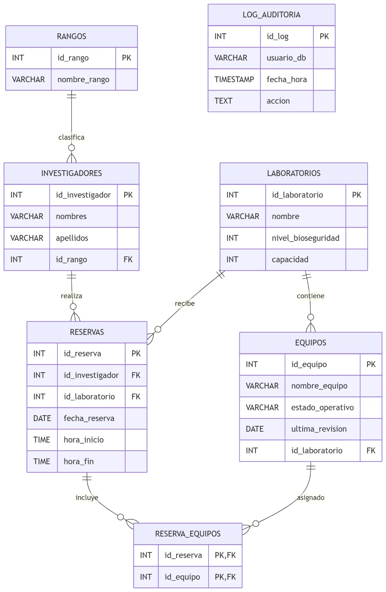

# SIGEBIO+ (Sistema Integral Avanzado de Gestion de Investigaciones Biogeneticas)

**Universidad de El Salvador**  
**Facultad Multidisciplinaria Oriental**  
**Departamento de Ingenieria y Arquitectura | Ingenieria de Sistemas Informaticos**  
**Diplomado de Preespecializacion - Actividad Evaluada No. 1**
**Elaborado por: Adilman Isai Portillo Ceron - PC18035 || Erving Fernando Amaya Villalta - AV16023**

---

## Descripcion del Proyecto
SIGEBIO+ es un sistema para la gestion de laboratorios de bioseguridad, investigadores, reservas, equipos y auditoria de eventos relevantes.

El esquema de base de datos esta versionado con Flyway y organizado para mantener integridad referencial, trazabilidad y evolucion controlada.

## Tecnologias
- PostgreSQL 15
- Flyway CLI
- Docker y Docker Compose
- pgAdmin 4
- Git y GitHub

## Estructura de Migraciones
Las migraciones SQL se encuentran en la carpeta [sql](sql):

- `V1__Initial_Schema.sql`
- `V2__Constraints_And_Indexes.sql`
- `V3__Auditing_Logic.sql`
- `V4__Equipment_Maintenance.sql`
- `V5__Seed_Data.sql`

## Requisitos Previos
- Docker Desktop (con Docker Compose)
- Flyway CLI

## Configuracion y Ejecucion
### 1. Levantar infraestructura
Desde la raiz del proyecto:

```bash
docker compose up -d
```

Servicios esperados:
- PostgreSQL: `localhost:5433`
- pgAdmin: `http://localhost:5050`

### 2. Revisar estado de contenedores
```bash
docker compose ps
```

### 3. Verificar conexion Flyway
```bash
flyway info
```

### 4. Ejecutar migraciones
```bash
flyway migrate
```

### 5. Validar migraciones
```bash
flyway validate
```

## Configuracion de Flyway
La configuracion principal esta en [flyway.conf](flyway.conf).

Valores actuales:
- URL: `jdbc:postgresql://localhost:5433/sigebio`
- Usuario: `admin`
- Esquema por defecto: `public`
- Ubicacion de scripts: `filesystem:./sql`

## Modelo de Datos
### Diagrama ER (Entidad-Relacion)
Deja aqui tu diagrama ER cuando lo tengas listo.



### Esquema Logico
El esquema logico relacional del sistema se compone de las siguientes entidades:

| Entidad | Atributos | Clave primaria | Claves foraneas | Restricciones y reglas |
|---|---|---|---|---|
| rangos | id_rango, nombre_rango | id_rango | - | nombre_rango obligatorio |
| investigadores | id_investigador, nombres, apellidos, id_rango | id_investigador | id_rango -> rangos.id_rango | nombres y apellidos obligatorios |
| laboratorios | id_laboratorio, nombre, nivel_bioseguridad, capacidad | id_laboratorio | - | CHECK nivel_bioseguridad BETWEEN 1 AND 4 |
| equipos | id_equipo, nombre_equipo, estado_operativo, id_laboratorio, ultima_revision | id_equipo | id_laboratorio -> laboratorios.id_laboratorio | al eliminar laboratorio, se eliminan equipos asociados |
| reservas | id_reserva, id_investigador, id_laboratorio, fecha_reserva, hora_inicio, hora_fin | id_reserva | id_investigador -> investigadores.id_investigador; id_laboratorio -> laboratorios.id_laboratorio | trigger de control para nivel 4 y trigger de auditoria |
| reserva_equipos | id_reserva, id_equipo | (id_reserva, id_equipo) | id_reserva -> reservas.id_reserva; id_equipo -> equipos.id_equipo | tabla puente para relacion N:M |
| log_auditoria | id_log, usuario_db, fecha_hora, accion | id_log | - | registro automatico de inserciones en reservas |

Cardinalidades principales:

- Un rango puede estar asociado a muchos investigadores (1:N).
- Un investigador puede realizar muchas reservas (1:N).
- Un laboratorio puede tener muchos equipos (1:N).
- Un laboratorio puede recibir muchas reservas (1:N).
- Una reserva puede incluir muchos equipos y un equipo puede aparecer en muchas reservas (N:M mediante reserva_equipos).

Reglas de negocio implementadas en el modelo logico:

- Solo investigadores con rango Director de Proyecto pueden reservar laboratorios de nivel 4.
- Toda insercion en reservas genera un registro en log_auditoria.
- La integridad referencial se mantiene con claves foraneas y acciones ON DELETE definidas en migraciones.

## Notas
- Si `flyway info` falla por autenticacion, verifica que Flyway use `localhost:5433` y no `5432`.
- El puerto `5432` puede estar ocupado por un PostgreSQL instalado localmente en Windows.
